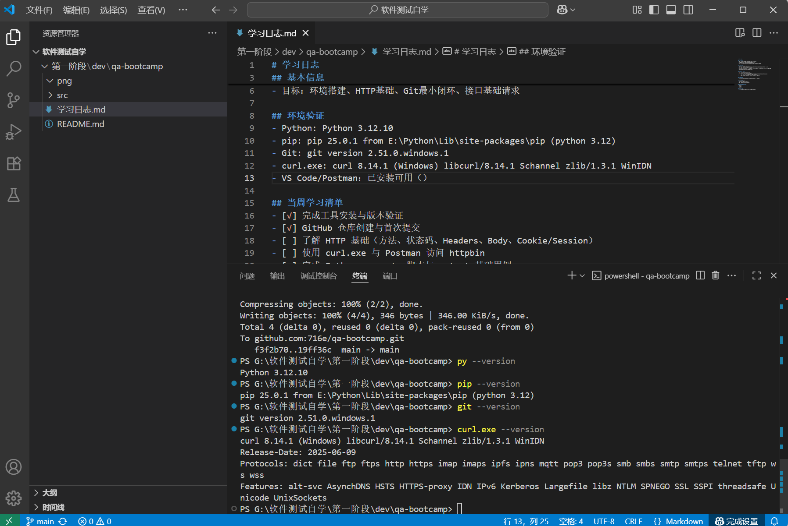

# 学习日志

## 基本信息
- 日期：2025-09-06 ~ 2025-09-13（第1–2周）
- 系统：Windows 10/11（管理员权限：是）
- 目标：环境搭建、HTTP基础、Git最小闭环、接口基础请求

## 环境验证
- Python: Python 3.12.10
- pip: pip 25.0.1 from E:\Python\Lib\site-packages\pip (python 3.12)
- Git: git version 2.51.0.windows.1
- curl.exe: curl 8.14.1 (Windows) libcurl/8.14.1 Schannel zlib/1.3.1 WinIDN
- VS Code/Postman：已安装可用（）

## 当周学习清单
- [√] 完成工具安装与版本验证
- [√] GitHub 仓库创建与首次提交
- [ ] 了解 HTTP 基础（方法、状态码、Headers、Body、Cookie/Session）
- [ ] 使用 curl.exe 与 Postman 访问 httpbin
- [ ] 完成 Python requests 脚本与 pytest 基础用例

## 笔记要点
- HTTP/HTTPS、状态码、常见请求方法、REST 概念摘要

## 实操记录
- curl 命令与输出
- Postman 配置与测试截图
- 运行 Python/pytest 的输出

## 遇到的问题与解决
- 问题：
- 原因：
- 解决：

## 下周计划
- 继续完善接口测试、用例设计、错误处理等